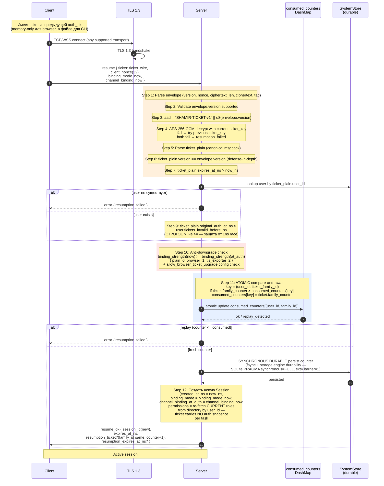
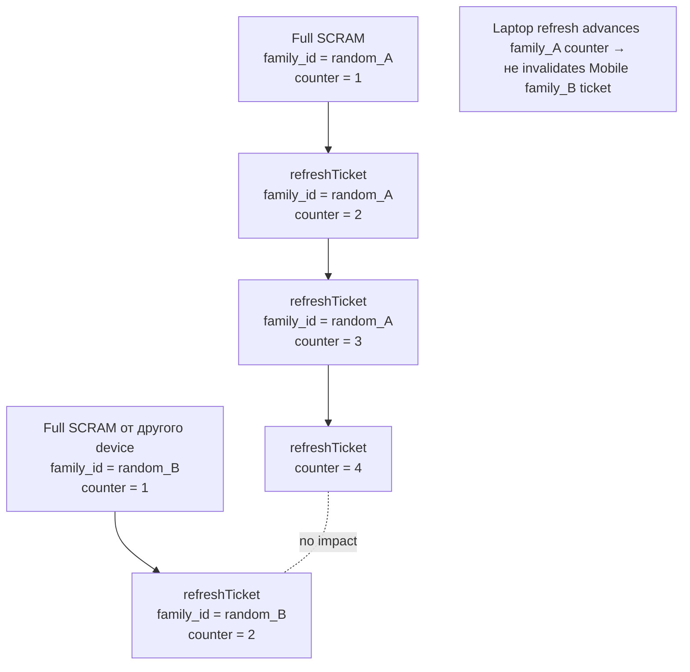

# 02 — Session Resumption

Fast reconnect (~10ms vs ~2s Argon2id) через encrypted ticket. См. SESSION_RESUMPTION.md.

## Ticket lineage (multi-device)

## Anti-replay invariants

| Сценарий | Защита |
|---|---|
| Same ticket дважды | `family_counter > consumed_counters[(user, family)]` → second fail |
| Stolen ticket replay в другой family | Different `family_id` → independent counter |
| Counter rollback при server crash | Synchronous fsync перед `resume_ok` (НЕ batched) |
| Backup restore с старым counter | `revokeAllTickets` mandatory (IMPL §5.7) |
| AAD tampering | GCM tag покрывает ciphertext+plaintext+aad |
| Ticket key compromise | Rotation 24h + emergency `revokeAllTickets` |
| Stale ticket после `kickSession` / `updateUser` | `original_auth_at_ns > tickets_invalid_before_ns` (strict >) |

## Identity rotation interaction

Если ticket issued под previous Ed25519 keypair AND `transition_until_ns > now_ns`:
- **v1:** server **rejects** resume → forces full re-auth → client получает `rotation_in_progress` в auth_ok → handles per AUTH §6.5
- См. SESSION_RESUMPTION §5.7
