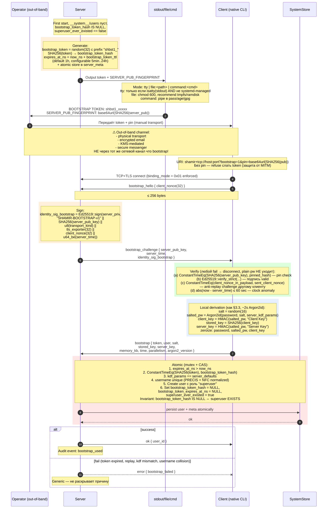

# 03 — Bootstrap (first admin creation)

Создание первого superuser. **Out-of-band pin mandatory**, browser bootstrap запрещён в v1. См. AUTH §11.

## Когда bootstrap **не** работает

| Условие | Reason |
|---|---|
| `superuser_ever_existed == true` | Защита от silent re-bootstrap при corrupted backup |
| `binding_mode != 0x01` (нет TLS exporter) | Browser bootstrap запрещён в v1 |
| `addr` не loopback AND profile=plain | Plain TCP loopback не поддерживает bootstrap |
| Username collision | Operator должен сначала удалить collision |
| `kdf_params != server_defaults` | Защита от malicious client |
| Token expired | TTL configurable 5min..24h |
| Token already used (CAS fail) | Single-use enforced atomically |
| Pin mismatch | Plain password НЕ покидает client |

## Recovery procedures

- **Lost admin password:** `shamir-server --regen-bootstrap --confirm` (требует stop сервера + физический доступ)
- **Token leak via logs:** TTL 1h спасает; alert на bootstrap_used event если source unexpected
- **Token file orphan:** server cleanup при startup (audit `bootstrap_token_file_orphan_cleaned`)
