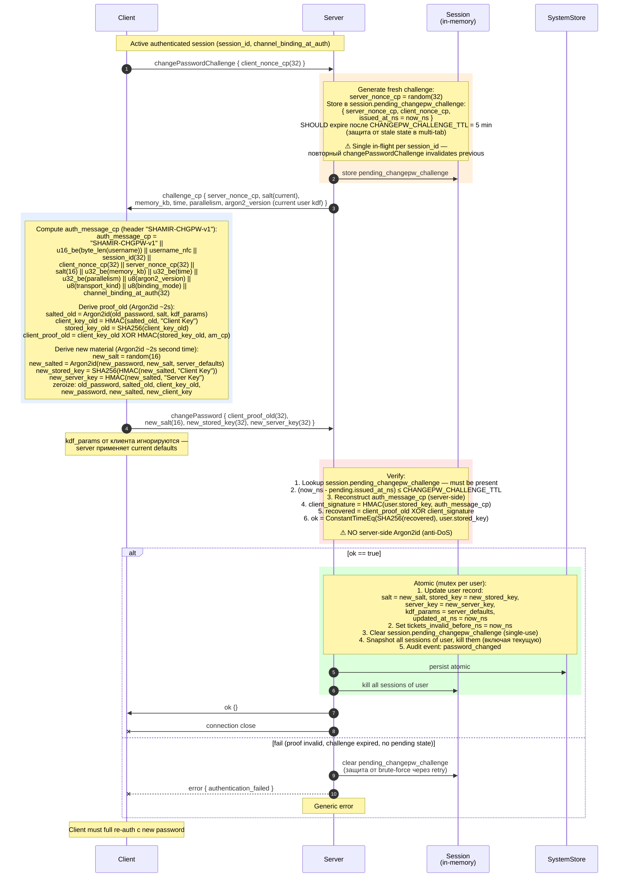
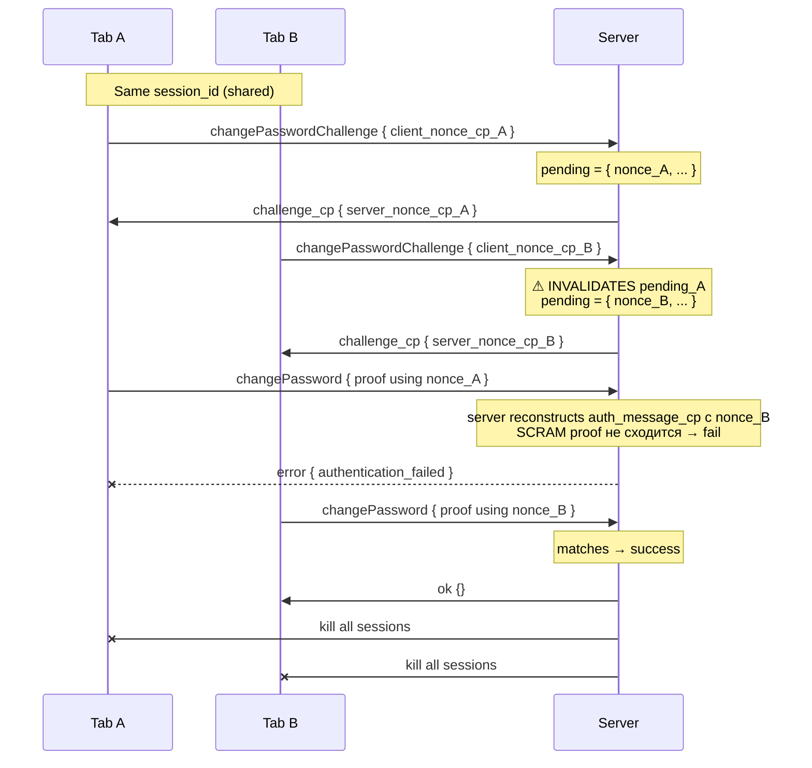

# 04 — Change Password

Self-service смена пароля внутри активной сессии. Two-step с fresh challenge, БЕЗ серверного Argon2id (anti-DoS amplification). См. AUTH §12.5.

## Multi-tab semantics

## Свойства

- **Plain password не покидает client** ни на одном шаге
- **No server-side Argon2id** в verify path (DoS-amp защита)
- **Session-bound** через `session_id` + `channel_binding_at_auth` в auth_message_cp
- **Single in-flight challenge** per session — multi-tab race well-defined
- **TTL 5 min** на pending challenge (защита от stale state)
- **All sessions killed** включая текущую (security boundary при rotation password)
- **Per-user mutex** — concurrent changePassword serialized
