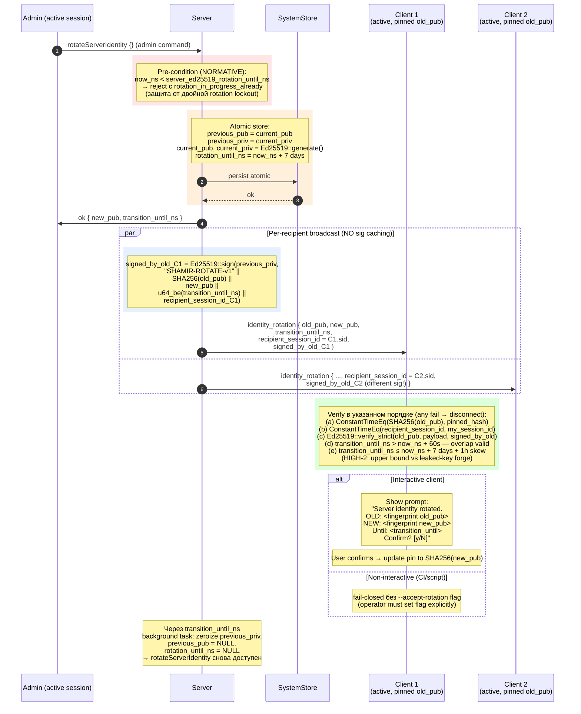
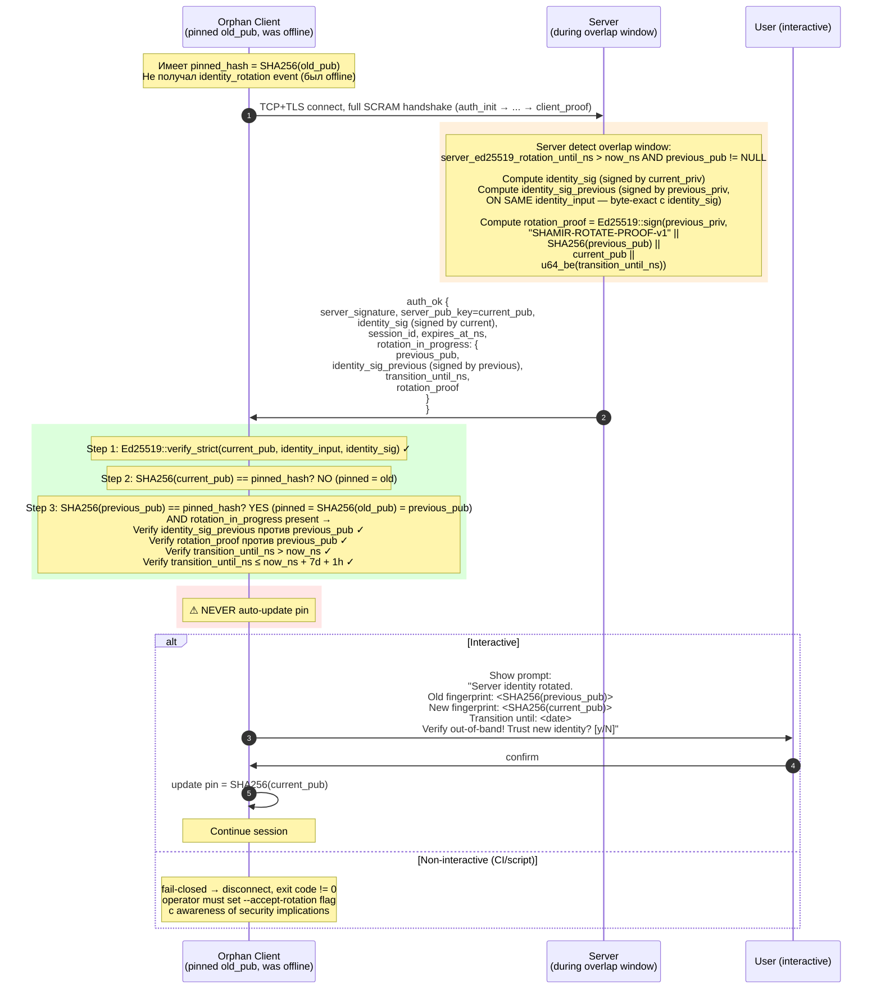
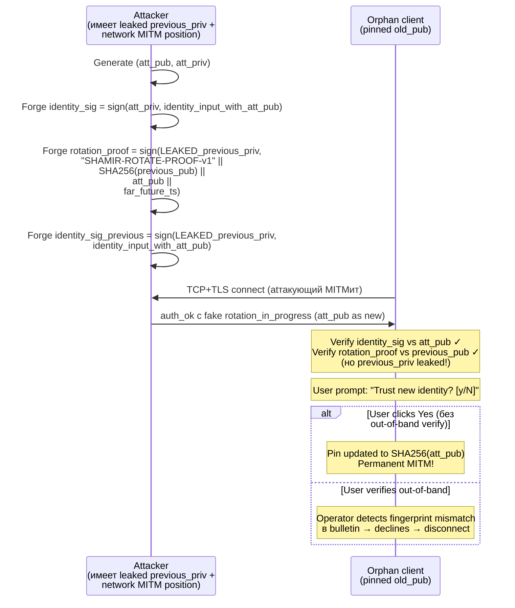

# 05 — Server Identity Rotation

Ed25519 server identity rotation с overlap window и orphan client recovery. См. AUTH §6.4-§6.5, §12.2.

## Часть A: Active session (broadcast)

## Часть B: Orphan client recovery (offline во время rotation)

## ⚠ Security caveat: leaked previous_priv

`rotation_proof` valid против previous_pub доказывает только: **подписан кем-то с previous_priv**. НЕ доказывает legitimate server, если previous_priv был скомпрометирован.

**Атака:**

## Mitigations

1. **Operators MUST verify через second channel** (signed announcement по email/GPG/etc) перед confirming
2. При подозрении на compromised previous_priv — использовать **emergency rotation** (`--identity-revoked` flag, IMPL §5.2), НЕ planned rotateServerIdentity. Emergency rotation НЕ выпускает rotation_in_progress payload — orphan клиенты получают `server_identity_changed` и выполняют manual re-pin
3. **Browser admin UI:** prompt должен показывать оба fingerprints visually и требовать typed confirmation, не click
4. **Server SHOULD** включать `transition_until_ns ≤ now + 7 days` (default). Не давать slack window > 7 дней
5. **Двойная rotation запрещена** в течение overlap (см. pre-condition в Part A)
