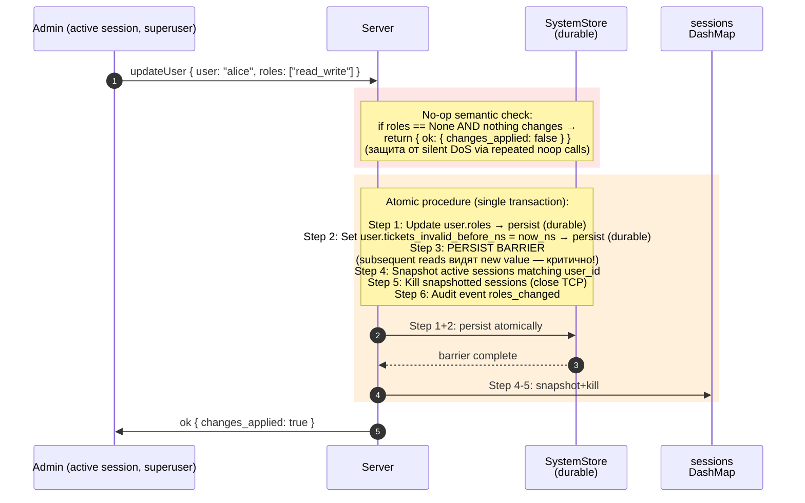
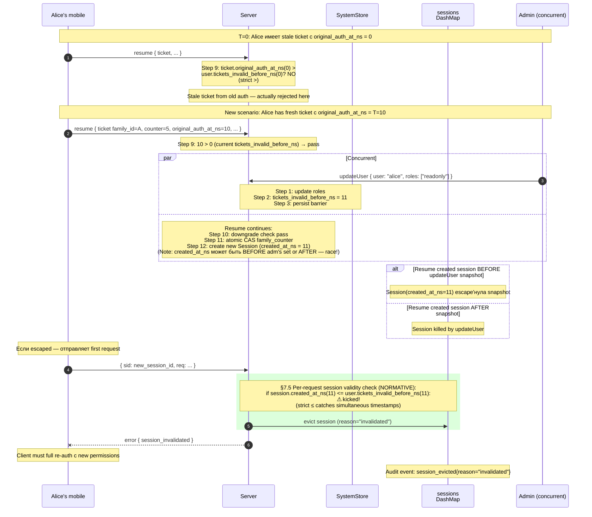

# 06 — Update User (admin) + Race Protection

Atomic role update с двухуровневой защитой от race с in-flight resumption. См. AUTH §12.5 + §7.5.

## Race scenario: in-flight resume escapes snapshot

## Defence layers summary

| Layer | Защита |
|---|---|
| **In-flight resume** (§5.4 step 9) | `original_auth_at_ns > tickets_invalid_before_ns` (strict >). Resume started **before** updateUser → passes. Resume started **after** persist barrier → fails immediately. |
| **Per-request validity check** (§7.5) | `session.created_at_ns <= tickets_invalid_before_ns` → kick. Catches sessions created **between** updateUser persist and snapshot/kill (escape window). |
| **Persist barrier** (Step 3) | Memory-store consistency: subsequent reads MUST see new tickets_invalid_before_ns. Without it, Step 4 snapshot might see stale value. |
| **Eager snapshot/kill** (Step 4-5) | Best-effort immediate eviction. Required для immediate TCP close. |
| **No-op semantic** | `roles=None` без changes → no invalidation. Защита от silent DoS via repeated noop. |

## Why both Steps 4-5 AND §7.5?

**Без §7.5** — Step 4-5 alone insufficient: race window между Step 3 (persist) и Step 4 (snapshot) позволяет new sessions slip through.

**Без Step 4-5** — §7.5 alone: session lives до next request. Idle session с stale permissions могла бы сидеть до 30 минут. Step 4-5 = best-effort immediate close.

**Both вместе:**
- Step 4-5: immediate kill для observable sessions
- §7.5: catch-all для escape sessions на их first subsequent request

Cost для §7.5 — один `u64 ≤` compare per request. Тривиально.

## Аналогичные операции

Те же двухуровневые защиты применяются для:
- `kickSession` (§12.4) — устанавливает `tickets_invalid_before_ns = now_ns`
- `revokeUserTickets` admin (SESSION_RESUMPTION §7.2) — same
