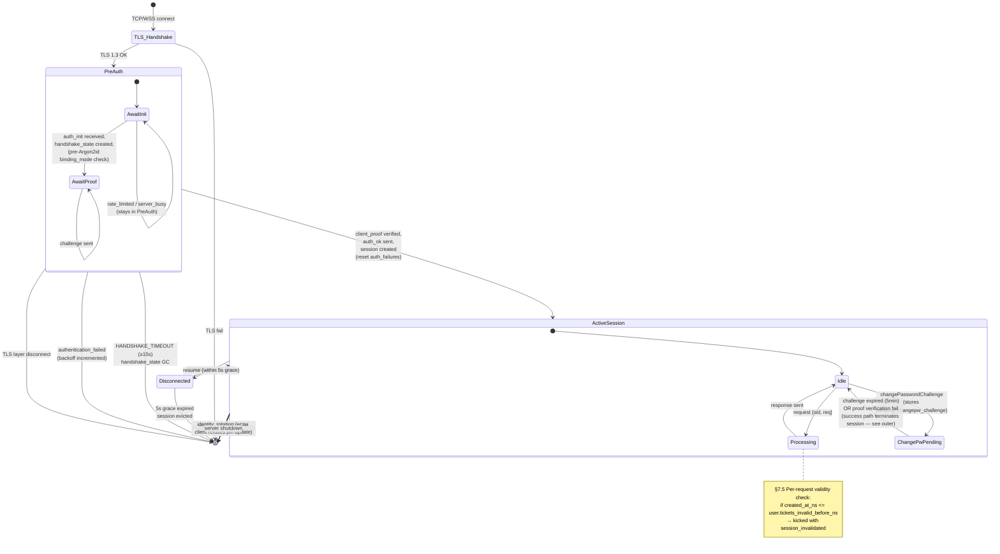
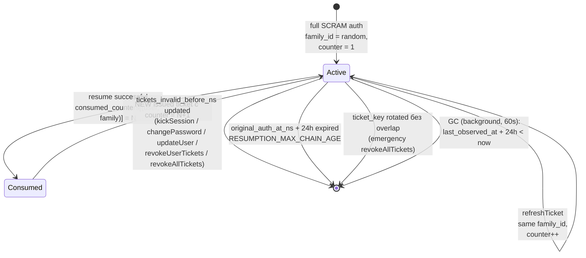
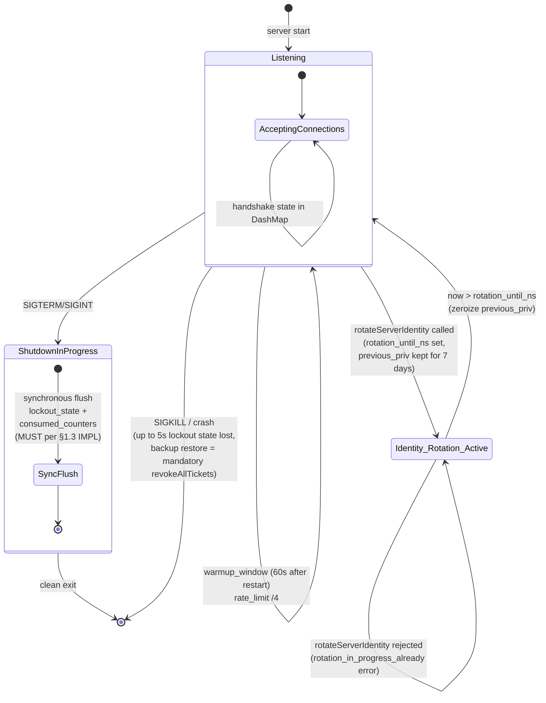

# 10 — Session Lifecycle (state diagram)

State machine от TCP connect до session eviction. См. AUTH §7.

## State transitions: terminal events

| Event | Reason in audit | Recovery |
|---|---|---|
| `HANDSHAKE_TIMEOUT` | `auth_aborted{reason="timeout"}` | Client retry |
| `authentication_failed` | `auth_failed` (rate-limited) | Client checks password |
| `idle_ttl_expired` | `session_evicted{reason="idle"}` | Resume via ticket OR full auth |
| `max_age_expired` | `session_evicted{reason="max_age"}` | Full auth (24h limit absolute) |
| `logout` | `session_evicted{reason="logout"}` | Explicit user action |
| `kickSession admin` | `kick_session` | Admin action, full re-auth required |
| `changePassword` | `password_changed` + `session_evicted{reason="kicked"}` | Full re-auth с new password |
| `updateUser` (per §7.5) | `session_evicted{reason="invalidated"}` | Full re-auth с updated permissions |
| `disconnect (no resume)` | `session_evicted{reason="disconnect"}` | Resume или full auth |
| `max_sessions overflow` | `session_evicted{reason="max_sessions_lru"}` | Older session killed |

## Concurrent state per (user_id, family_id)

## Per-listener state machine (server-side)

