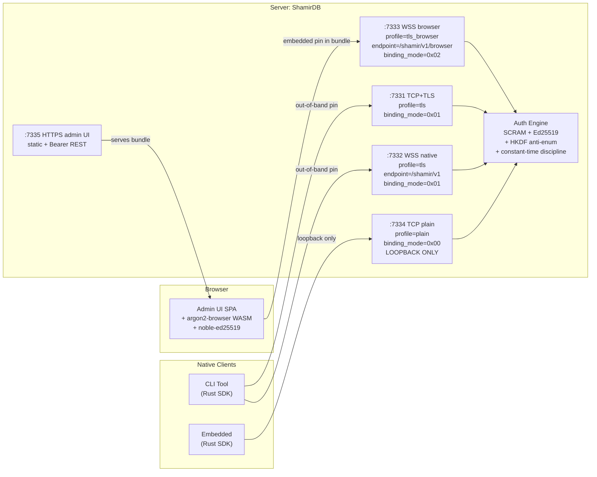
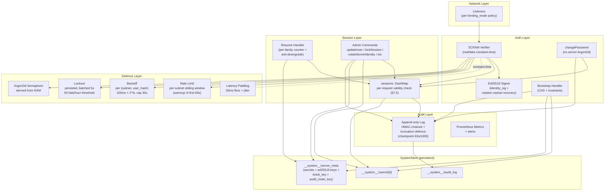
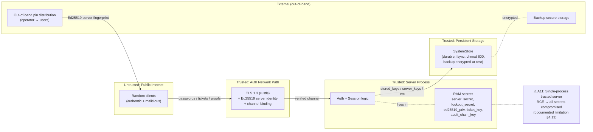

# 11 — Component Overview (architecture)

High-level архитектура: clients, transports, server components, persistence.

## Clients ↔ Server transports

## Server internal components

## Trust boundaries

## Adversary mapping (см. SECURITY_MODEL §1)

| Adversary | Защищён | Документировано как limitation |
|---|---|---|
| A1 Passive observer | TLS 1.3 | — |
| A2 Active MITM | TLS + Ed25519 pin + channel binding | — |
| A3 Offline DB snapshot | Argon2id memory-hard | — |
| A4 Live RAM read | mlock / disable_core_dumps best-effort | Partial |
| A5 Malicious admin | Audit log HMAC chain (forensics, not prevention) | Out of scope |
| A6 Compromised client | known_hosts MAC | Partial |
| A7 Supply chain | — | Out of scope |
| A8 Spectre/cache | — | Out of scope (acknowledged) |
| A9 Hardware tamper | — | Out of scope |
| A10 DoS | Multi-layer (rate-limit, backoff, lockout, semaphore, padding) | — |
| A11 Single-process RCE | mitigations only (mlock, etc) | Documented (§4.13) |
| A12 Compromised origin (browser) | Limited (embedded pin защищает narrow case) | Documented (§4.9) |
