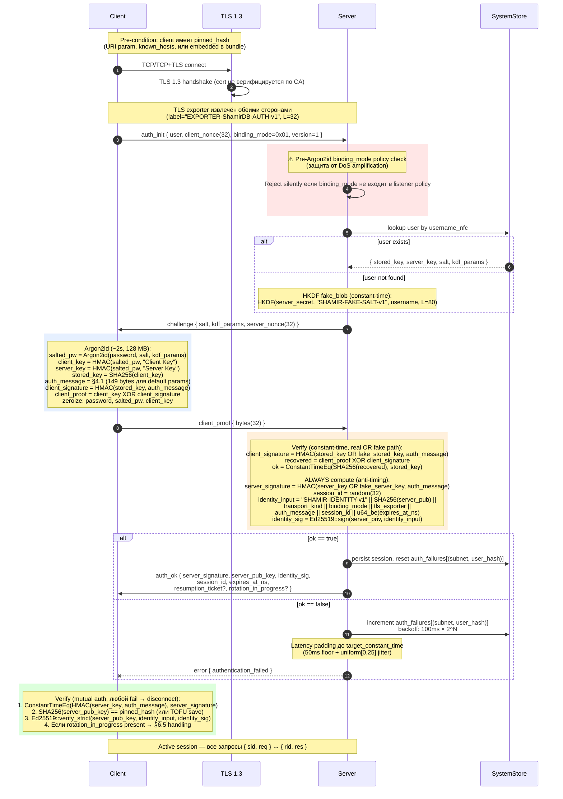

# 01 — Initial Auth (full SCRAM)

Full SCRAM-Argon2id handshake с channel binding и Ed25519 server identity. См. AUTH_PROTOCOL §2-§5.

## Ключевые свойства

- **Pre-Argon2id binding_mode check** (шаг 4) — защита от DoS amplification
- **Constant-time fake path** (шаг 6) — anti-enumeration через HKDF
- **All three crypto operations always computed** (шаг 9) — устраняет timing oracle
- **Latency padding** на negative path — устраняет real/fake distinguisher на microsecond уровне
- **Reset on success** — auth_failures очищается для (subnet, user_hash)
- **Mutual auth** — обе стороны верифицируют (SCRAM proof + Ed25519 identity + pin)

## Edge cases

- **Pre-state GC:** state без proof через `HANDSHAKE_TIMEOUT` (≥15s) → drop
- **Argon2id semaphore exhaustion:** `MAX_CONCURRENT_ARGON2=64` → `server_busy`
- **Rate limit per subnet:** `RATE_LIMIT_AUTH_INIT_PER_SUBNET=10/sec` → `rate_limited`
- **Lockout** (50 fails/час per (subnet, user)): silent (генерик `authentication_failed`)
- **`rotation_in_progress` в auth_ok** (during overlap window) → клиент handles via §6.5
